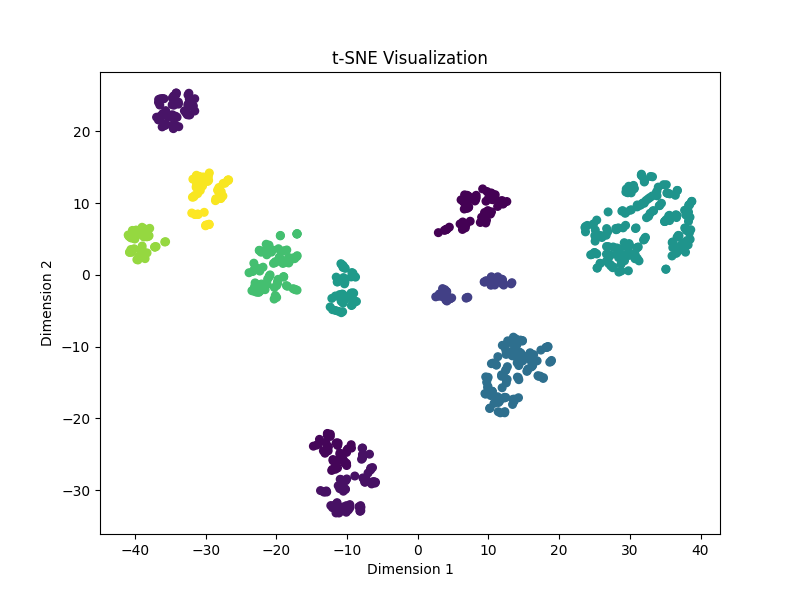

# Readme

## About this repo

這個 repo 存放了使用 [veri776 dataset](https://vehiclereid.github.io/VeRi/) 進行 pretraining 的 code 以及 pretrained model。

模型的 backbone 使用 [ResNet101-ibn-a](https://pytorch.org/hub/pytorch_vision_ibnnet/)，loss function 使用 cross entropy loss 以及 triplet loss，完整的資料可以在 [這篇 paper](https://arxiv.org/pdf/1903.07071.pdf) 找到。

這個 repo 與上述 paper 的差異有以下幾點:
1. last stride 並未設成 1
2. 並未加入 center loss (加了以後在訓練上 loss 直接變成 NaN)
3. training epochs 與 learning rate scheduler 不同

結果在 veri776 測試集上可以達到 98 rank 1 accuracy (含 junk images)，以及 78 rank 1 accuracy (不含 junk images)。

Junk images 是指與 probe 於同一個鏡頭下拍的車，可能會出現高度相似的照片，因此 rank 1 會高到不可思議，範例如下:


在 triplet loss 與 cross entropy loss 的訓練下，input 會被模型映射到具有辨別力的空間，相似 vehicle 的 embedding 在這個空間會相似，不相似 vehicle 的 embedding 在這個空間則會不相似。使用 test set 中 10 台不一樣的 vehicle，以及他們對應的所有照片的 feature embeddings 經 tSNE 降維後如下:




## About the pretrained model
在這個 repo 的 [release](https://github.com/b06b01073/veri776-pretrain/releases/tag/v3-hubconf) 有提供 pretrained model，可以直接使用。

使用範例如下:

```python=
# load the weights of pretrained model, see the release 
# the options of models are ['resnet101_ibn_a', 'resnext101_ibn_a', 'densenet169_ibn_a', 'se_resnet101_ibn_a', 'swin_reid'] 
net = torch.hub.load('b06b01073/veri776-pretrain', 'resnet101_ibn_a') 
net = net.to('cpu')
net.eval() # 別忘了設成 eval model，避免 BatchNorm 追蹤 running mean


# img_paths is a list of path to the vehicle images
for img_path in img_paths: 
    input = Image.open(img_path) # open an image
    input = test_transform(input) # image preprocessing, see Transforms.py


    # eu_feat is the f_t in https://arxiv.org/pdf/1903.07071.pdf, and cos_feat is the f_i.
    eu_feat, cos_feat, _ = net(input.unsqueeze(dim=0))


    # 以下可以把 feature 拿來做你想做的事情
```

> [!WARNING]  
> 在初次使用 `torch.hub.load` 時，這份 repo 會被自動下載到 local 端的 cache 中 (例如你的 linux 中的 ~/.cache/ 資料夾底下)，這樣的預設行為可以避免每次都要從 repo 抓資料。然而，當這份 repo 有新的 commits 時，local 端的檔案不會被更新，如果你發現有奇怪的 bug 出現時 (GitHub 上明明有的 function，你的 local 端卻一直報錯說找不到該 function)，就需要將 local 端的 cache 清理掉。

### In case you want to train the model
如果你有想要 train 這個 model，或做一些實驗，請先[下載](https://drive.google.com/open?id=0B0o1ZxGs_oVZWmtFdXpqTGl3WUU) veri776 資料集，並且在 `main.py` 的 `--dataset` 參數提供 veri776 的 root folder。

```
.
├── veri776
│   ├── ReadMe.txt
│   ├── YongtaiPoint_Google.jpg
│   ├── camera_Dist.txt
│   ├── camera_ID.txt
│   ├── gt_index.txt
│   ├── image_query
│   ├── image_test
│   ├── image_train
│   ├── jk_index.txt
│   ├── list_color.txt
│   ├── list_type.txt
│   ├── name_query.txt
│   ├── name_test.txt
│   ├── name_train.txt
│   ├── test_label.xml
│   ├── test_track.txt
│   ├── test_track_VeRi.txt
│   └── train_label.xml
├── veri776ReID
│   ├── DMT_scheduler.py
│   ├── IBN_Net.py
│   ├── Trainer.py
│   ├── Transforms.py
│   ├── asset
│   ├── main.py
│   ├── model.py
│   ├── readme.md
│   ├── requirements.txt
│   ├── tSNE.py
│   ├── veri776.py
│   └── weights
.
.
.
```

在這個例子裡面 `veri776` 是 veri776 資料集的 root folder (請勿更動內部檔案命名，否則有些檔案會抓不到)，而 veri776ReID 則是這個 GitHub 的 repo。那麼要訓練模型的指令就會是:

```
$ python veri776ReID/main.py --dataset=veri776 --backbone=resnet
```
